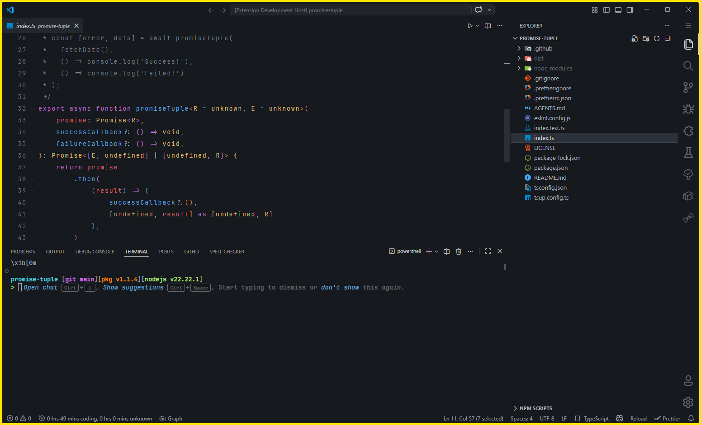
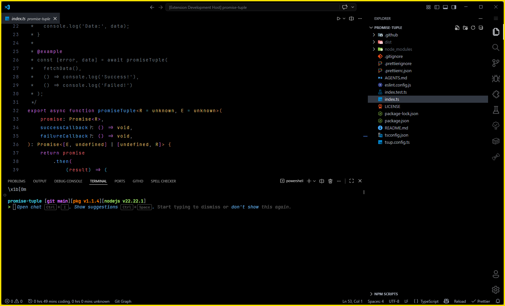

  

<h1 align="center">donato one dark</h1>

  Dark color themes for <a href="https://code.visualstudio.com/">Visual Studio Code</a> and <a href="https://antigravity.codes/">Google Antigravity IDE</a> based on the One Dark color scheme — available in <strong>Flat</strong> and <strong>OLED</strong> variants.

  <a href="https://marketplace.visualstudio.com/items?itemName=ebdonato.donato-one-dark">VS Code Marketplace</a>
  &nbsp;·&nbsp;
  <a href="https://open-vsx.org/extension/ebdonato/donato-one-dark">Open VSX Registry</a>

## Inspired by

This theme is inspired by [One Dark Pro](https://github.com/Binaryify/OneDark-Pro) ([VS Code Marketplace](https://marketplace.visualstudio.com/items?itemName=zhuangtongfa.Material-theme)), one of the most popular dark themes for VS Code. donato one dark builds on the same One Dark color palette while offering a flat/borderless UI and a true-black OLED option.

## Theme Variants

### donato one dark flat

A dark gray (`#16191d`) theme with a flat, borderless look — no visible panel separators for a clean, uniform UI.

### donato one dark oled

A pure black (`#000000`) theme designed for OLED displays — saves power and eliminates glow around the edges of the screen.

## Installation

### Visual Studio Code

1. Open **Extensions** in VS Code (`Ctrl+Shift+X`).
2. Search for `donato one dark`.
3. Click **Install**.
4. Go to `Preferences: Color Theme` (`Ctrl+K Ctrl+T`) and select either **donato one dark flat** or **donato one dark oled**.

### Google Antigravity IDE

Antigravity IDE is fully compatible with VS Code themes. This extension is published to the [Open VSX Registry](https://open-vsx.org/extension/ebdonato/donato-one-dark), which Antigravity uses by default.

1. Open **Extensions** in Antigravity (`Ctrl+Shift+X`).
2. Search for `donato one dark`.
3. Click **Install**.
4. Go to `Preferences: Color Theme` (`Ctrl+K Ctrl+T`) and select either **donato one dark flat** or **donato one dark oled**.

## Color Palette

Both variants share the same syntax highlighting colors:

| Role       | Color                                                | Hex       |
| ---------- | ---------------------------------------------------- | --------- |
| Foreground |  | `#abb2bf` |
| Red        |  | `#e06c75` |
| Green      |  | `#98c379` |
| Yellow     |  | `#e5c07b` |
| Blue       |  | `#61afef` |
| Purple     |  | `#c678dd` |
| Cyan       |  | `#56b6c2` |
| Orange     |  | `#d19a66` |
| Comments   |  | `#7f848e` |

## License

[MIT](LICENSE)

## Made by with 💛

   
  <strong>Eduardo DONATO</strong>

